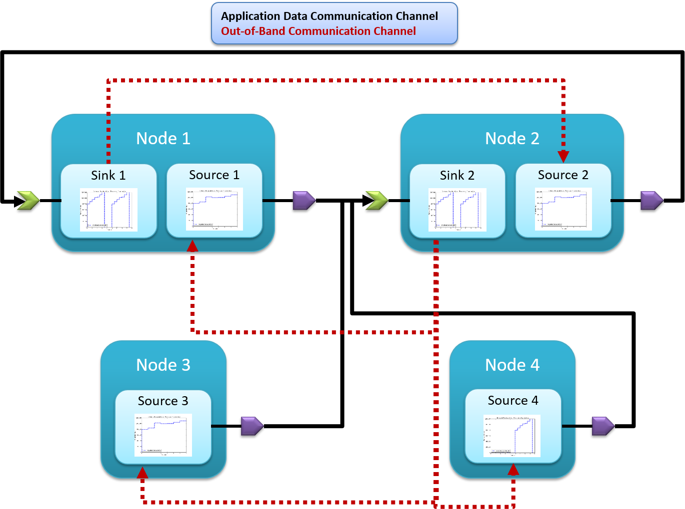

.. _run_time:

Run Time Results
================

Middleware-integrated Measurement, Detection, and Enforcement
-------------------------------------------------------------

.. _fig-component:

.. figure:: images/results/ros_component.png
   :align: center
   :width: 400px

   Schematic representation of a software component.

Our run-time research and development of measurement, detection, and
enforcement code for networked applications is built on the foundation
of component-based software engineering (CBSE).  The goal of CBSE is
to provide a reusable framework for the development of application
building-blocks, called *components* so that developers can develop
and *analyze* applications in a more robust and scalable manner.  In
CBSE, a *component*, shown schematically in :num:`Figure
#fig-component`, is the smallest deployable part of an application and
is defined as:

.. math:: C = \{\{T\},\{P\},H\}

Where

* :math:`\{T\}` is the *set* of all *timers* within the component.  A
  timer provides a periodic event trigger to the component which
  triggers the callback associated with :math:`T`.
* :math:`\{P\}` is the *set* of all *input/output ports* within the
  component.  An i/o port provides a mechanism for message passing and
  event triggering between components, and may take the form of
  asynchronous *publish/subscribe* or synchronous *client/server*
  interaction patterns.  Similarly to timers, each incoming event
  triggers the callback associated with :math:`P`.
* :math:`H` is the single thread which executes all event events for
  the component, in FIFO order, without preemption.  

From this component definition, we can define an application as:

.. math:: A = \{\{C\},\{M\}\}

Where

* :math:`\{C\}` is the *set* of components in the application
* :math:`\{M\}` is the *set* of *mappings* between ports of the
  components in :math:`\{C\}`, for instance connecting a subscriber of
  :math:`C_x` to a publisher of :math:`C_y`, :math:`M_{x,y} :
  C_x\{P_S\}\mapsto C_y\{P_P\}`.

And finally, an application's components are grouped into processes
and distributed onto the nodes of a system through a deployment
defined as:

.. math:: D = \{\{N\},\{U\},\{M\}\}

Where

* :math:`\{N\}` is the *set* of hardware *nodes* in the system
* :math:`\{U\}` is the *set* of *processes* defining the deployment,
  where a process is a collection of components
  :math:`U=\{C\}\subseteq A\{\{C\}\}`.
* :math:`\{M\}` is the *set* of *mappings* between processes and nodes
  in the system, e.g. :math:`M_{U_1,N_1} : U_1\mapsto N_1`.

Note here that though the components may be single threaded
internally, the application containing these components may run them
in parallel, e.g. by grouping them into a process or distributing them
among the hardware nodes of the system.  An example application and
deployment onto a system of nodes is shown in :num:`Figure #fig-cbse`.
Note that multiple applications (shades of blue in this figure) may be
deployed simultaneously onto the same system and may even interact
with each other.

.. _fig-cbse:

   Two example distributed CBSE applications deployed on a system with
   4 nodes.

We have implemented these features based on our design-time results:

* Traffic generators according to profile generated into sender code
* Receiver service according to profile generated into receiver code
* Measurement of output traffic on sender side and input traffic on
  server side generated into code
* Detection of anomalous sending on sender side
* Mitigation of anoumalous sending on sender side
* Detection of anomalous sending on receiver side
* Push back to sender middleware through out-of-band channel for
  anomaly detection on server side

Each of these functions uses the same profiles which enable
design-time system and application analysis.  This integration not
only helps with running experiments and data collection but also helps
to ensure model to system consistency.
  
.. _fig-sender:

.. figure:: images/results/app_layers.png
   :align: center
   :width: 400px

   The structure of component-based applications and how their network
   traffic traverses the middleware and the OS stack.

We have implemented profile-based traffic generators and traffic
measurement into our code generators that we use with our model-driven
design software.  We developed this toolsuite to create distributed
component-based software which uses ROS as the communications
middleware.  For publish/subscribe interactions between components,
into the generated code we add generic traffic generators which read
their associated profile from the deployment XML file and publish
traffic on their publisher port according to that profile.
Additionally, these publish operations are generated to use a small
wrapper which can measure the publish rate and can decide to throw a
*profile exceeded* exception if the application attempts to send too
much data or if the receiver has pushed back to the sender informing
it to stop.  The sender-side middleware layer is shown in :num:`Figure
#fig-sender`.

This push back from the receiver occurs through the use of an
out-of-band (OOB) channel using UDP multicast, which receivers use to
inform specific senders that they are sending too much data to the
receivers (and possibly overflowing the receiver buffers).  This OOB
channel provides a mechanism by which the secure middleware layer can
protect the system from malicious or faulty applications.

Into the receiver code (for subscribers) we additionally generate a
receive buffer and receiver thread which reads the receiver profile
from the deployment XML file and pulls data from the buffer according
to the profile.  In this scenario, the receiver has a capacity with
which it can handle incoming data, and it has a finite buffer so it
must use the OOB channel and measurements on the incoming data stream
to determine which senders to shut down to ensure its buffer does not
overflow.  When the buffer has had some time empty (so that it's not
in danger of running out of buffer space), the receiver can use the
OOB channel to inform the halted senders that it is alright to send
again.  

.. figure:: images/results/traffic_generation.png
   :align: center
   :width: 400px

   Demonstration of the accuracy with which our traffic generators
   follow the specified profile.  

.. note:: The measured bandwidth profile is calculated based on
	  recorded time series data of :math:`[reception\_time,
	  message\_size]`, so the bandwidth drops to nearly 0
	  periodically since the :math:`\Delta t` is so large between
	  the messages.

.. note:: Our original implementation of traffic generators performed
	  better since they did not utilize a middleware layer and
	  relied instead on simple point to point ipv6 connections.
	  However, that code was less useful for system analysis
	  because it could do nothing aside from traffic generation
	  and measurement; our current implementation which generates
	  traffic generation code into component code is more
	  versatile for several reasons:

	  * The component-based code integrates directly into our development
	    toolsuite and deployment framework so it can be easily deployed on
	    our cluster.
	  * Configuring different system topologies or component to host
	    mappings (deployments) is simpler and more robust, allowing us to
	    perform more and more varied experiments.
	  * The traffic generation code can be removed (or the code can be
	    regenerated without the option selected) and the rest of the
	    component-based and middleware code is still useful as an actual
	    application.

Distributed Denial of Service (DDoS) Detection
----------------------------------------------

DDoS attacks can take many forms, but are generally classified as
excessive traffic from a large amount of (possibly heterogeneous)
sources targeted towards a single point or a single group.  Such
attacks are common to machines on the internet, but can also become a
hazard for machines on private networks which become infected or
inadvertently expose an input path for external malicious data.  

These private or semi-private systems must have mechanisms for
detecting and mitigating such attacks, and the combination of our
design-time analysis and run-time measurement, detection, and
mitigation tools provides such capability.

If we relax the constraint from the design-time section that all
sender profiles are absolute and the system behavior is completely
known at design-time, then we not only expand the scope of
applications that can be supported but also enable meaningful anomaly
detection.  Instead of treating the application profiles as the exact
amount of data that the applications need to send, we assume they are
the mean amount of data that the application will need to send over
each respective interval.  Additionally, we add an upper curve to the
application profiles which is the guaranteed maximum that the
application will ever try to send in each respective period.

For system analysis, we perform the design-time analysis on both the
mean-data curve and the max-data curve which each give predicted
buffer space requirements for the senders and receivers. Since buffer
space on many of these systems comes at a premium, we cannot always
take the maximum buffer size from this calculation as our
implementation. For the senders, we are free to choose the allocated
buffer space in the deployed system within this range as we see fit,
since the senders have a large degree (or full) control over the
sender rate and can meter themselves to not lose data.  However, for
the receivers, we can select a buffer size within the mean-max range
based on our total system capacity and then rely on the measurement,
detection, and mitigation code to ensure that we do not lose data due
to buffer overflowing.

In this scenario, the receiver has been given knowledge of all of the
sender profiles which might transmit data to it.  When the receiver
detects that the buffer is filling up quickly enough to overflow the
buffer in the near future, it can use the measurements that have been
gathered about the received traffic up to this point to determine
which sender components to throttle temporarily.

   The nodes in the network and how they communicate (using pub/sub).  

We shown experimentally that, for example, a server side buffer size
of 400000 bits, which would normally grow to 459424 bits because of
excessive data pumps on the sender sides, is kept to 393792 by
utilizing this out-of-band channel and secure middleware.

